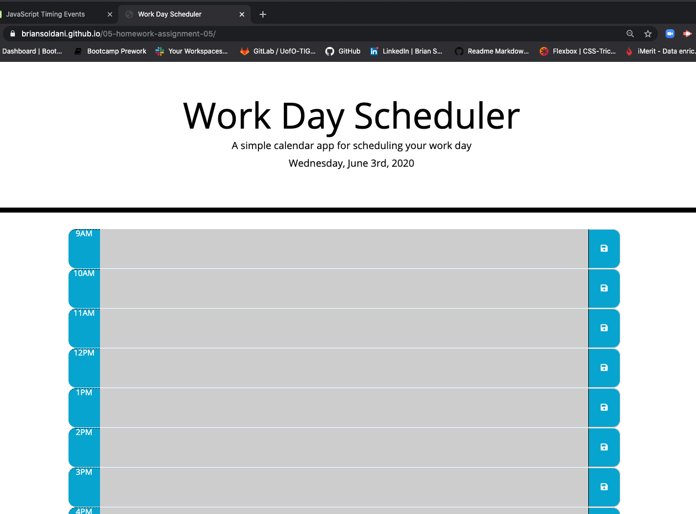

# 05 Third-Party APIs: Work Day Scheduler

This assignment was to complete a functioning Work Day Planner that ran inside the browser and featured dynamically updated HTML and CSS powered by our Javascript and jQuery. Using the starter code provided in the HTML5 and CSS3 files along with the Moment.js library for date and time references, we were tasked with updating the existing files and creating all new Javascript and jQuery code to complete this project.

## Project Details
Using the above mentioned technologies and code sources, along with the javascript and jQuery code that was developed to run them, the deployed application was created. The application consists of the following:

 - Current day, date, and time presented at the top of the application.
 - Standard business hours from 9am to 5pm are shown on the page.
 - Each time block is color coded to show past, present, or future hours.
 - The user is able to enter multiple tasks for each hour block of time.
 - The user can save each task in any time block.
 - The user can edit any of the tasks as needed.
 - Tasks are saved in local storage and are available upon page refresh.
 
 ### Results
 The final application meets all of the requirements. Tasks are saved in the local storage and persists as user visits the page and makes edits. This was a very fun project and I'd like to go back through the application and try to use dry code in both the HTML and Javascript files.

#### URL of Deployed Application + Image

 https://briansoldani.github.io/05-homework-assignment-05/

 